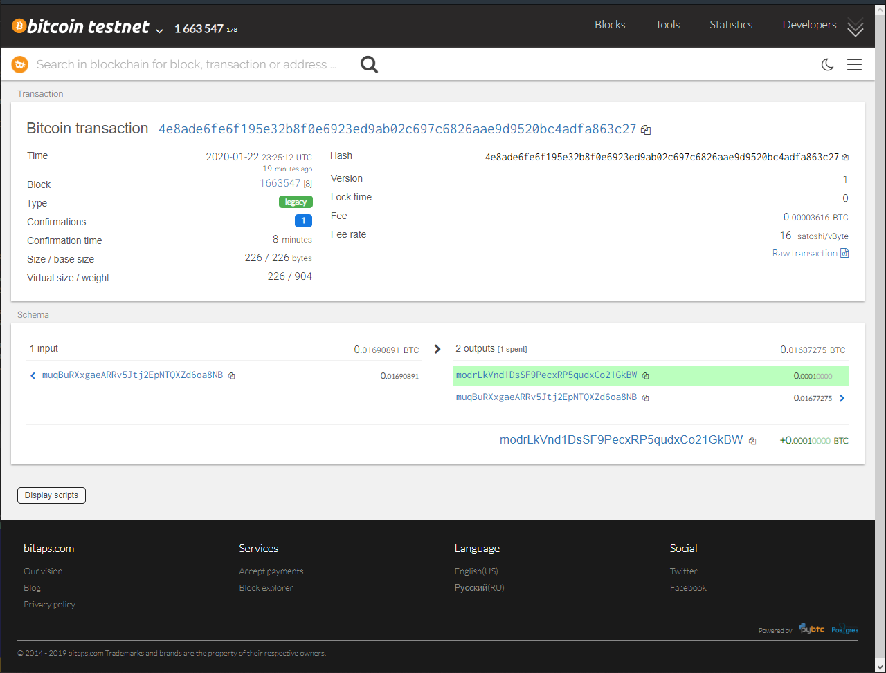
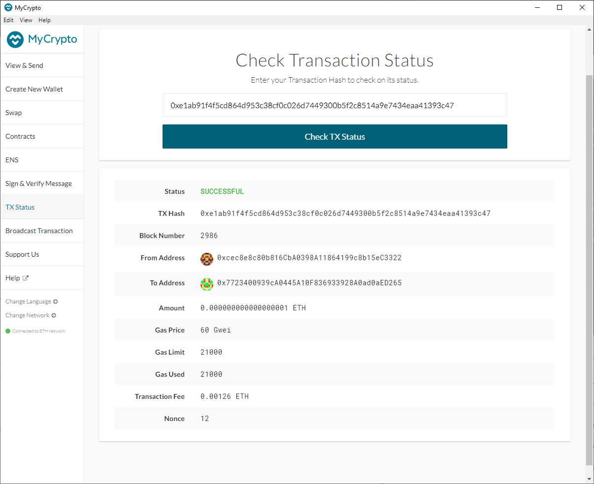

# Multi-Blockchain Wallet in Python

### This wallet can transact on both Ethereum and Bitcoin Testnet using HD-Wallet-Derive to create BIP44 child wallets. Users can specify the Mnemonic phrase in the .env file as well as the coin type (ETH or BTC-TEST) and number of child wallets per coin type. 

Install:

1) Installing pip dependencies using requirements.txt
2) Clone the hd-wallet-derive tool into this folder and install it using the following instructions https://github.com/dan-da/hd-wallet-derive#installation-and-running 

    Create a symlink called derive for the hd-wallet-derive/hd-wallet-derive.php script into the top level project
directory like so: 

```
ln -s hd-wallet-derive/hd-wallet-derive.php derive
```
This will clean up the command needed to run the script in our code, as we can call ./derive instead of ./hd-wallet-derive/hd-wallet-derive.php.

3) Open a new terminal window inside of this folder and
then run python. Within the Python shell, run 

 ```bash
 from wallet import *
```
4) To transact on BTC-TEST net run the following code in the Python Shell

```
btc_account = priv_key_to_account(BTCTEST,btc_pk)

send_tx(BTCTEST,btc_account,'modrLkVnd1DsSF9PecxRP5qudxCo21GkBW',0.0001)
```
Screenshot of trsnaction record is as follows:
<p align="center">

</p>

5) To transact on ETH via geth (note 2 POW nodes have to be running) run the following code in the Python Shell

```
eth_account = priv_key_to_account(ETH,eth_pk)

send_tx(ETH,eth_account,'0x7723400939cA0445A10F836933928A0ad0aED265',1)
```
Screenshot of trsnaction record is as follows:


<p align="center">

</p>

